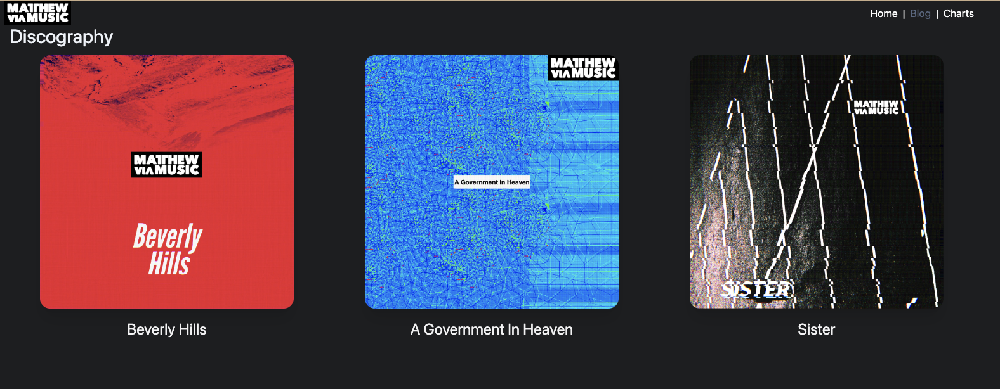
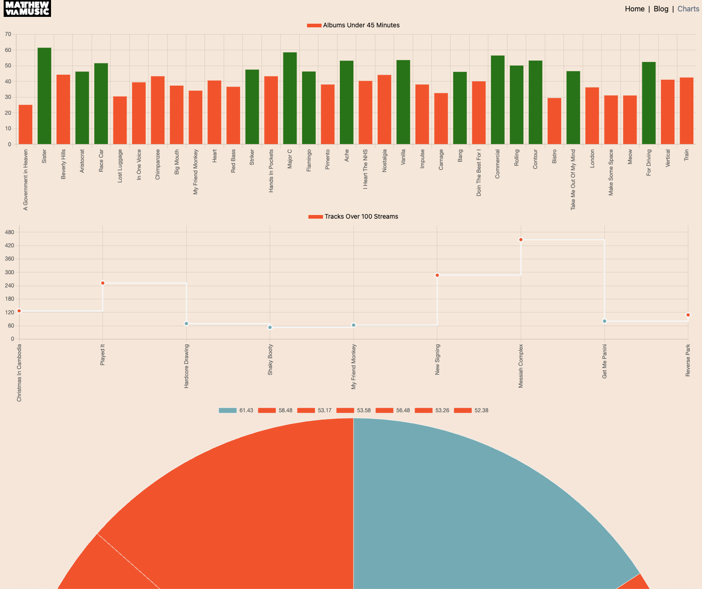

## Astron - An Astro Starter Project

<a href="https://mattheweq.com/astron/" target="_blank">VISIT LIVE SITE</a>

[API](https://mvmapi.olk1.com/tracks)






```
npm create astro@latest projectName
npx astro add tailwind
npm i -D @tailwindcss/typography
npx astro add mdx
npx astro add react
npm i framer-motion

"dev": "astro dev --port 5000"
```

```
astro workflow configured - use github pages
```
